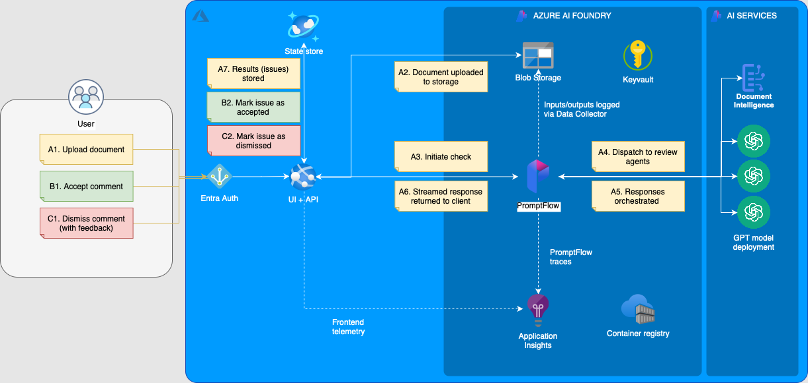
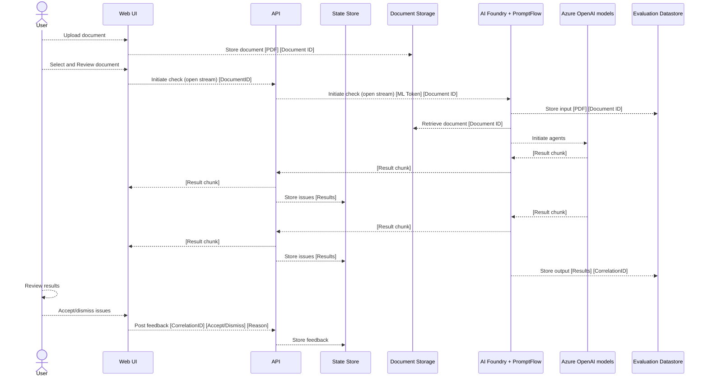

# Architecture Overview

## Components

**UI & API App**
_(Azure App Service)_

- A React frontend for document upload, review, and feedback submission, including:
  - Document upload and retrieval client-side to Azure Blob Storage.
  - PDF Viewer with annotation capabilities.
  - Real-time streaming to API for review results.
- A Python REST API built using FastAPI, serving:
  - Static assets for the React frontend (JavaScript, CSS, HTML).
  - Interactions with Azure services such as Cosmos DB and PromptFlow endpoints.
  - Streaming connections for real-time feedback and results.
  - Feedback submission to Cosmos DB.

**State Store**
_(Azure Cosmos DB)_

- Stores document analysis results and user feedback.
- Configurations:
  - Advanced Threat Protection enabled.
  - System Assigned Managed Identity.
  - CORS and local authentication disabled.

**AI Platform**
_(Azure AI Foundry Hub)_

- Azure AI Services:
  - GPT model deployments for domain-specific document analysis.
  - Configured with System Assigned Managed Identity and restricted public access.
- PromptFlow:
  - Used for authoring and orchestrating AI workflows from document ingestion to invoking agents and yielding results.
  - Endpoints deployed to Azure App Service for hosting (instead of ML-managed Online Endpoints due to [timeout limitation](https://learn.microsoft.com/en-us/azure/machine-learning/how-to-manage-quotas?view=azureml-api-2#azure-machine-learning-online-endpoints-and-batch-endpoints) of 180s for long-running streams).
  - Monitoring and traceability using Application Insights.
- Key Vault:
  - Securely manages keys and credentials.
  - Configured with system-assigned identities, audit logging, and soft delete.
- Storage Account:
  - Securely stores PDF documents, PromptFlow files, inference inputs and outputs.
  - Configurations: secure transfer, private network access, and TLS 1.2.
- Azure Container Registry (ACR):
  - Hosts private containers used by AI Foundry.
  - Configured with managed identities and disabled anonymous pull.

## User/Data Flow

## Cost + Scaling

- **Azure App Service**: A single plan is utilised across the API and Flow endpoints. Automatic scaling rules can be added to handle spikes in traffic while keeping costs optimised.
- **Azure ML Compute**: Uses serverless compute by default for cost-efficient scalability.
- **Azure OpenAI**: Global Standard Deployments are used with pay-per-call billing for high availability and load balancing across regions for higher token limits.

### Considerations

Whilst a good general baseline is illustrated in the accelerator, the following considerations should be taken into account when customising for your specific use case and organisational requirements:

- Data residency requirements: do GPT models need to be hosted in a specific region? If so, Global Standard may not be suitable.
- Anticipated tokens-per-minute usage: if high and/or predictable, pre-purchasing quota may provide significant cost savings.
- Model versions: if wanting to use a new version of GPT or another model, this may only be available in certain regions or with specific deployment types.

Take a look at this [guidance](https://learn.microsoft.com/en-us/azure/ai-services/openai/how-to/manage-costs) for more information on planning and managing costs with Azure AI Services.

## Security

### Networking

- [Network Security Perimeter](https://learn.microsoft.com/en-us/azure/private-link/network-security-perimeter-concepts) is used to secure Platform-as-a-Service resources including Cosmos DB within a private network. This can be modified with access rules to limit inbpound and outbound traffic to specified destinations.
- [Managed Network](https://learn.microsoft.com/en-us/azure/ai-studio/how-to/configure-managed-network?tabs=portal) is enabled for Azure AI Foundry Hub to secure its resources within a private network. This can be further configured to restrict outbound traffic to specific IP ranges or services.

### Secret Management

- [Managed Identities](https://learn.microsoft.com/en-us/entra/identity/managed-identities-azure-resources/overview): utilised across all resources for service-to-service communication, ensuring secure, passwordless authentication across services utilising RBAC authorization.

### User Management

- Authentication for end-users the UI, API and Storage is controlled via [Entra ID IAM](https://learn.microsoft.com/en-us/entra/fundamentals/introduction-identity-access-management?toc=%2Fentra%2Fidentity-platform%2Ftoc.json&bc=%2Fentra%2Fidentity-platform%2Fbreadcrumb%2Ftoc.json). Named users and groups can be assigned roles and permissions to control access to resources.
- An `ml_engineers` Entra ID group is created as part of infrastructure deployment to provide access to the Azure AI Foundry Hub, with the required permissions to author, test and deploy PromptFlow flows.
