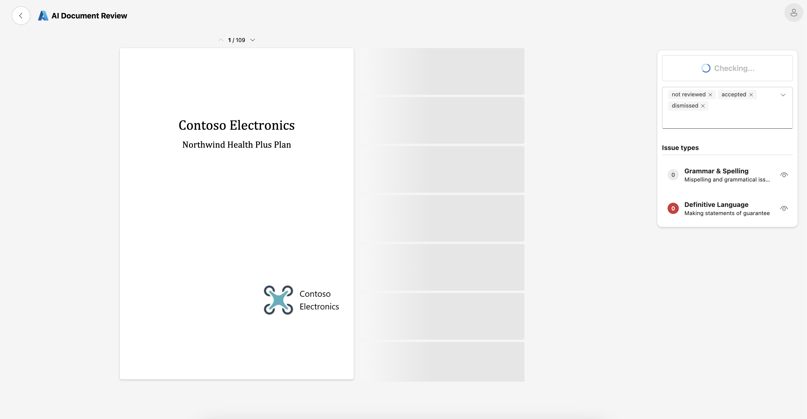

# Getting Started

Welcome to the project! This guide will help you get started quickly by using the provided Dev Container and Taskfile setup. The Dev Container is pre-configured with all essential tools to streamline development and ensure consistency across environments. Below is a detailed breakdown of the tools, configurations, and architecture components, along with instructions to get you up and running.

## Using the Dev Container

The Dev Container simplifies the development environment by bundling all required tools:

1. Open the repository in Visual Studio Code.
2. Install the Remote - Containers extension.
3. Reopen the repository in the Dev Container when prompted.

## Tasks Overview

The project uses Taskfile to automate development tasks. This ensures consistency and reduces manual errors. Run the following command to list all available tasks:

```bash
task -a
```

### Key Task Categories

- Infrastructure:

  - `infra-deploy`, `infra-destroy`, `infra-plan`: Automate provisioning, updating, and destroying of Azure resources using Terraform.
  - `infra-state-*`: Manage and inspect the state of deployed infrastructure.

- Application:

  - `app-build`, `app-clean`, `app-deploy`: Build, clean, and deploy both API and UI components efficiently.
  - `app-build-api`, `app-build-ui`: Focused build tasks for API or UI-only workflows.

- PromptFlow:

  - `flow-deploy-*`: Deploy and manage PromptFlow flows (AI review agents) to Azure AI Foundry.

- Development and Debugging:

  - `api-run`: Launch the API locally for testing and development.
  - `deps-*`: Ensure dependencies are installed and toolchains are set up correctly.

## Deploying the solution

The first step is to deploy the necessary Azure resources. This is managed through Terraform scripts and automated via Taskfile tasks.

### Authenticate with Azure

Before deploying infrastructure, authenticate with Azure using the CLI:

```bash
az login
```

If using CI/CD pipelines, Managed Identities or Service Principals should be configured for authentication.

### Initialise Terraform

Terraform requires initialisation to download necessary providers and prepare for infrastructure deployment. Run:

```bash
task infra-init
```

### Deploy Resources

1. Copy the sample variables file:

```bash
cp infra/environments/local.tfvars.sample infra/environments/local.tfvars
```

2. Edit `local.tfvars` with environment-specific configurations such as region, resource names, and other parameters.

3. Deploy infrastructure:

```bash
task infra-deploy
```

After deploying the infrastructure, `.env` files will have been autogenerated in the `app/ui`, `app/api` and `flows` directories.

### Deploy the Application

Build and deploy the application to the designated App Service:

```bash
task app-build
task app-deploy
```

> Note: the deployment may take a few minutes to complete. You might see a 504 error (GatewayTimeout), but the deployment will still be running in the background. If so, follow the link in the error output to view the deployment logs.

### Deploy PromptFlow endpoint

The project supports deploying flows automatically using predefined Taskfile commands. To deploy the main flow, run:

```bash
task flow-deploy
```

This will deploy the flow code from the `flows` directory to the PromptFlow service in Azure AI Foundry. Once completed, you can then deploy an endpoint where the flow can be hosted and called:

```bash
task flow-deploy-endpoint
```

> Note: this will take a few minutes to complete. You can view progress in the `Models + Endpoints` section of the project in [Azure AI Foundry](https://ai.azure.com).

### Access the Application

At this point, if everything's deployed successfully, you can access the web UI at your deployed WebApp's URL, which you can get from the Terraform output:

```bash
(cd infra && terraform output webapp_url)
```

After accessing the web UI, you can upload a PDF document and start the review process, which will invoke the flow endpoint you've just deployed to run the content through the AI review agents.



Issues identified by the agents will be displayed in the UI as they're returned in a stream for each chunk of the document.

You can click each to view more details and accept or dismiss them, and optionally provide feedback on why they were wrong, which is stored to Cosmos DB with the results of the check.

## Debugging the Application locally

1. Create a virtualenv for the API if it doesn't already exist and install the required packages:

   ```bash
   cd app/api
   python3 -m venv .venv
   source .venv/bin/activate
   pip install -r requirements.txt
   ```

2. Select the new venv Python interpreter in Visual Studio Code

   `Ctrl+Shift+P` > `Python: Select Interpreter` > `app/api/.venv/bin/python3`

3. Install the required packages for the web UI:

   ```bash
   cd app/ui
   npm install
   ```

4. Ensure you are logged in to Azure in the VS Code terminal so the API can retrieve required credentials

   ```bash
   az login
   ```

5. Select the compound debug profile `App (UI & API)` in Visual Studio Code and press Debug

#### Debugging Tips

- The Vite server proxies API requests (`/api`) to `localhost:1231` when running locally
- Ensure you've created the `.env` files for both the API and UI as per the _Application Setup_ section

### Developing with PromptFlow

Refer to the [Promptflow setup](./promptflow/promptflow_setup.md) instructions to get started with modifying and authoring flows locally and deploying them to Azure.

---

By following this guide, you can efficiently set up, build, and deploy both infrastructure and application components. For additional support, consult the documentation of the individual tools or raise an issue in the project repository.
