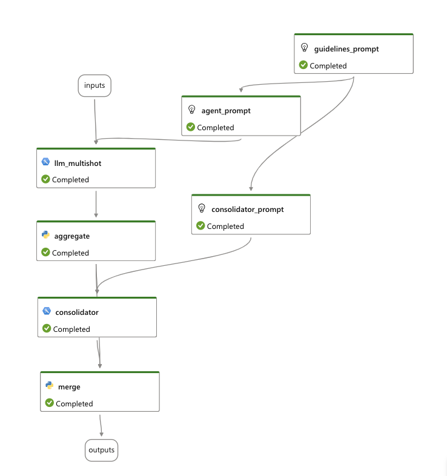

## Agent Flow Design

The agent flow consists of the following components:

- `llm_multishot` - This is the node for sending multiple requests with the same prompt to OpenAI. The output of the node is the list of responses from OpenAI.
- `aggregate` - This node aggregates and deduplicates the responses from OpenAI.
- `consolidator` - Taking as inputs the output of the agent prompt, and the guideline prompt, the consolidator ranks the results and verifies how well the results correspond to the guidelines, and whether they should be kept or discarded.
- `merge` - This node merges the responses from `consolidator` with the aggregated responses and forms the final response.

In addition, the agent can be parametrised by providing the following prompts:

- `agent.jinja2` - This is the main prompt for the agent. It contains the logic for the agent including description of the instructions on how to fix issues in the input text, examples, and description of the output fields to return
- `guidelines.jinja2` - This is a separate prompt containing guidelines for the specific agent. It contains detailed taxonomy of possible issues in the inptu text.
- `consolidator.jinja2` - This is the prompt for the consolidator node (see above).

## How to add a new agent

To add a new agent to the main flow, follow these steps:

1. Add a new value to the `IssueType` enum in `common/models.py`. This value will be used to identify the agent in the main flow.

1. Navigate to the agent flow template. The agent template can be found under `flows/ai_doc_review/agent_template`.

1. Using the agent flow template, create the prompts for the new agent. You will need to create the following prompts:

   - `agent.jinja2` This will contain the main logic for the agent.
   - `consolidator.jinja2` This will contain the logic for the consolidator node which accumulates and ranks the results of the agent prompt.
   - `guidelines.jinja2` This will contain the guidelines for the agent as a separate template.

   Make sure your prompts provide a reference for the JSON fields that the agent will use as an output.

   You can see the prompts for the already created agents under `flows/main_flow/prompts/`.

   You can test your agent using the `agent_template` flow by running it either from VSCode extension, or from the Promptflow UI. For more information, see [the doc on setup up with Promptflow](./promptflow_setup.md).

1. Add the new agent to the main flow.

   Firstly, create a new folder with prompts under `flows/main_flow/prompts/` and put your prompts there.

   Then, add the new agent to the `AGENT_PROMPTS` dictionary in `flows/main_flow/prompts/flows.py`. The key should be the `IssueType` enum value you created in step 1, and the value should be the path to the folder with the prompts.

1. Test the main flow either in VSCode, or in the Promptflow UI.
