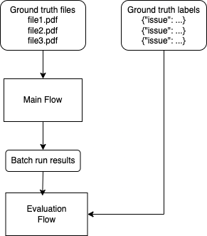
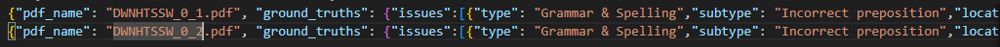
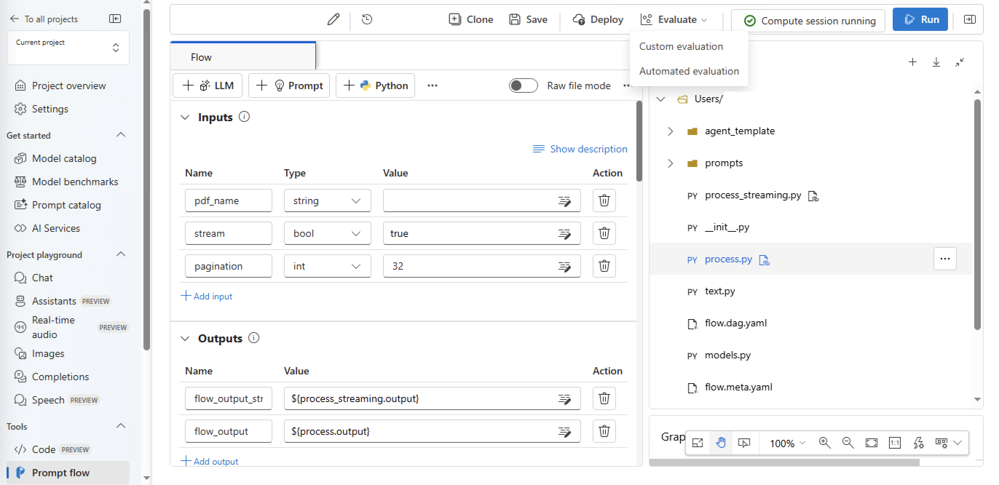
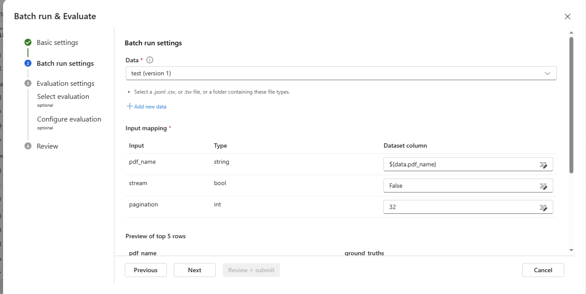
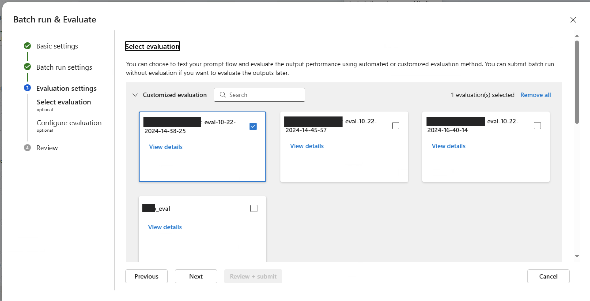
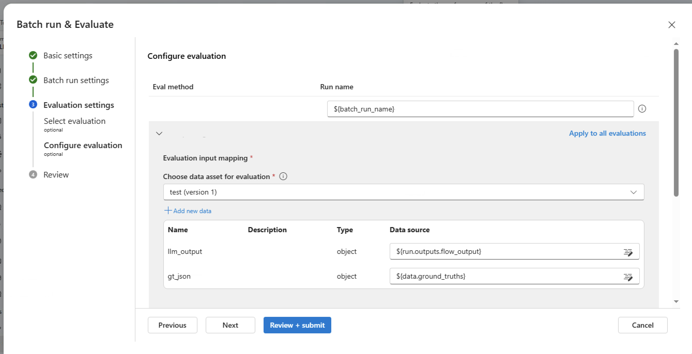
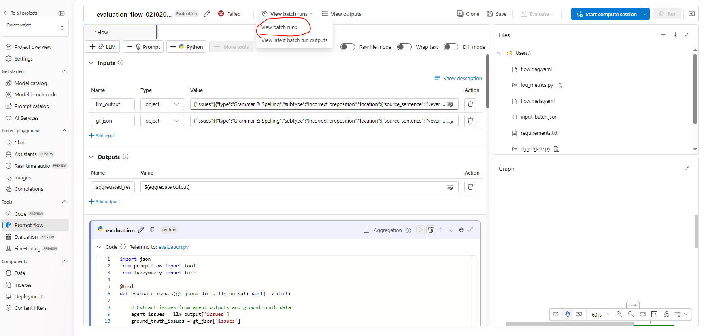
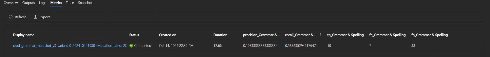

# Evaluation Flow

The evaluation flow is used to evaluate the performance of the main flow by comparing their output to ground truth data.

The evaluation flow performs a batch run of the main flow using the ground truth data as input. The output of the main flow is then compared to the ground truth data to compute metrics that evaluate the performance of the main flow.

# How to Evaluate Agents Using Promptflow

This section describes the way of evaluating Agents with Ground Truth Data.

## Requirements

- Ground Truth Data must be collected in a JSONL file. See example below. Objects must be in 1 line and **NOT delimited by comma**
  

## Step by step guide in Promptflow UI

1. From the main flow (`ai_doc_review`) we click on Evaluate > Custom Evaluation

2. Next we upload **Ground Truth data in a JSONL format as mentioned in Requirements**

Input mapping references which Agent field corresponds to which Ground Truth field.

In this case:

- `pdf_name` corresponds to the document name stored in blob storage
- `stream` must be set to False
- `pagination` could be set to any desired value, or left blank to use a default value. See more information in the [flow documentation](./main_flow_design.md).

3. Select custom eval flow

Here, select the previously deployed evaluation flow. Refer to the [deployment documentation](./deployment.md) on how to deploy the evaluation flow.

4. Pick data source inputs and submit for evaluation

- llm_output: Agent run output **(output must be in a dict)**
- gt_json: Ground Truth Data JSONL **(output must be in a dict)**

5. Check the results of the Evaluation Flow

Once the flow is finished the results can be found in the evaluation flow under **View batch runs**

6. Results of the Evaluation flow can be located under **Metrics**

