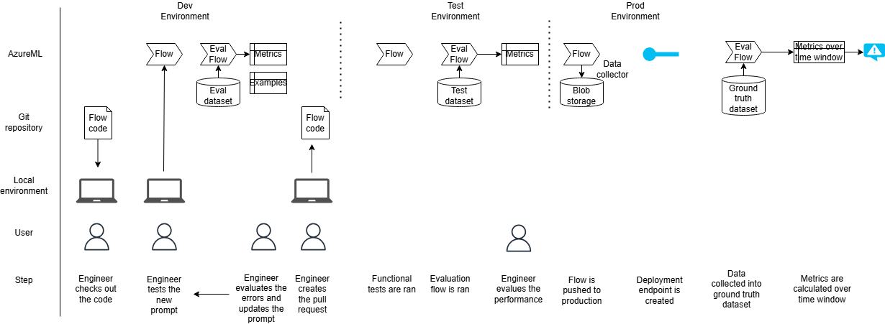

# LLM Ops

## Lifecycle of an LLM app

The diagram above shows how the main flow and the evaluation flow can be used on all stages of a prompt development lifecycle, across multiple deployed environments with differing datasets. This is purely illustrative and shows just one approach you could take to implement an LLMOps process.

### Development

During development of a new prompt or of any other corresponding code, the developer checks out the code of the repo where the flow definition and code is committed, and is able to test the solution using a VSCode extension.

They can run the flow locally using their own test data as an input.

They can also set up connection to [Azure AI Foundry Compute Instance](https://learn.microsoft.com/en-us/azure/ai-studio/how-to/create-manage-compute) which has access to an **evaluation dataset**. This is a portion of a ground truth dataset that's been set aside for development, and the developers can look at the output of the solution when ran on this data, and use it for improvement.

### Creating a pull request

Once the engineer is satisfied with performance of the solution on the evaluation dataset (which they could determine by invoking the evaluation flow), they create a pull request with the updated flow code and / or prompts.

The functional tests are first run, which will include infrastructure tests.

Then, the new flow will be evaluated using the same evaluation flow, but a different dataset, **test dataset**. The purpose of this dataset is to calculate model performance metrics, and the exact mistakes that the model is making are hidden from the developer to prefer information leakage.

These results will be evaluated by the pull request reviewer, and they approve the pull request if satisfied with flow performance.

### Production

Once approved, the pull request gets merged automatically, the infrastructure and flow get deployed to production, and a new deployment endpoint is created using the new version of the flow.

Once in production, the inputs and outputs of the endpoint will be automatically persisted using the [AzureML Data Collector](https://learn.microsoft.com/en-us/azure/machine-learning/concept-data-collection?view=azureml-api-2).

For the endpoint running in production, performance could be monitored using the built-in [AzureML model monitoring](https://learn.microsoft.com/en-us/azure/machine-learning/prompt-flow/how-to-monitor-generative-ai-applications?view=azureml-api-2). More on this in the [monitoring section](#monitoring).

## Data Collection & Evaluation

The data collection process is crucial for the improvement of an LLM app over time. The data collected can be used to periodically update the test and evaluation datasets, and to monitor the performance of the agents (and their corrseponding prompts) in production to determine whether prompts need to be improved to catch missed issues, or to address identified issues that were not in fact correct/appropriate.

### Data to calculate the confusion matrix

The data collected from the users needs to be sufficient to identify three of the types of the mistakes in the confusion matrix: True Positive, False Positive, True Negative, (False Negative is unused as there is no good way of calculating that).

| True Positive  | False Positive           |
| -------------- | ------------------------ |
| False Negative | _True Negative_ (Unused) |

Data will be collected differently for True Positive, False Positive and False Negative scenarios.

- For False Negative scenario, the mistake is not identified by the solution.

> How you collect this will depend on the process and tooling of your existing document review process. It may involve asking your reviewers to label issues that should have been caught in a subset of documents and loading these into your dataset.

- For True Positive and False Positive categories, there is a mistake idenitified by the solution, correctly in case of True Positive, and incorrectly in case of False Positive. As such, the user is asked to provide feedback on the identified mistake within the UI which adds this into a feedback object within the issue in the database.

### Running an evaluation

PromptFlow provides the concept of an [evaluation flow](https://learn.microsoft.com/en-us/azure/machine-learning/prompt-flow/how-to-develop-an-evaluation-flow?view=azureml-api-2) that can be used to evaluate the performance of a companion flow. In our case the evaluation flow takes as input the output issues from the agents within the main flow, combined with the ground truth data, and computes the metrics described in the previous section to evaluate the performance of each agent.

More information on running the evaluation flow can be found [here](./evaluation_flow.md). These can be invoked manually, or programmatically (i.e. tests as part of a CI/CD pipeline).

## Monitoring

To continuously monitor the model deployed to production, built in [AI Foundry monitoring capabilities](https://learn.microsoft.com/en-us/azure/machine-learning/prompt-flow/how-to-monitor-generative-ai-applications?view=azureml-api-2) are available.

In addition to built-in capabilities for monitoring performance of classification models with provided ground truth data, [custom metrics](https://learn.microsoft.com/en-us/azure/ai-studio/how-to/monitor-quality-safety?tabs=azure-studio) can also be implemented and displayed in a dashboard depending on your monitoring requirements (i.e. to display the acceptance rate of issues, distribution of issue types).
