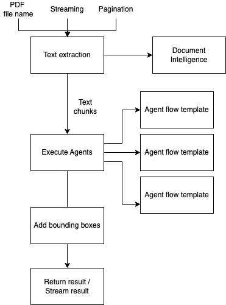

## Main flow design

The main flow is the entry point for the Promptflow application. It is responsible for orchestrating the execution of the agents and the evaluation of the agents. The main flow is responsible for the following tasks:

- Extracting text information from a PDF document using Azure Document Intelligence
- Splitting the extracted text into text chunks according to the `pagination` argument
- Executing all agents using the text chunks as an input
- Depending on the value of `stream` argument, either streaming the results back to the caller, or collecting results for all agents and text chunks and returning them to the caller

A high-level diagram of the main flow can be seen below:

Code for the main Promptflow flow can be found under `flows/ai_doc_review`.

### Agent execution

To run the agent code from the main flow, we execute the agent flow as a "function" (see [documentation](https://microsoft.github.io/promptflow/how-to-guides/execute-flow-as-a-function.html)). As the agent template does not contain any of the prompts, we use [overrides](https://microsoft.github.io/promptflow/how-to-guides/execute-flow-as-a-function.html#local-flow-as-a-function-with-flow-inputs-override) to substitute the prompts and the connections for the agents.

### Pagination

The main flow implements pagination which means splitting the input text into chunks for later processing and executing agents for each chunk separately.

When the flow runs in streaming mode, the results are returned separately for each chunk, making the results available quicker for the caller.

When the flow runs in non-streaming mode, the results are returned only after all agents have been executed on all chunks. This mode is useful when the caller needs to aggregate the results from all agents and all chunks.

The pagination is implemented using the `pagination` argument which specifies the number of paragraphs in each chunk. The main flow splits the input text into chunks of the specified size and runs the agents on each chunk separately. The results are then aggregated and returned to the caller.

Pagination argument can be set to `-1` which would disable it and cause the entire input text to be processed at once.

### Structured JSON

In order to improve reliability of the application, we make use of the Structured JSON feature, avaialable in the newer versions of OpenAI models. See the [blog post](https://openai.com/index/introducing-structured-outputs-in-the-api/) with the announcement of the feature. The feature allows us to specify the structure of the output we expect from the model, which the model is then guaranteed to return. This allows us to avoid writing code to handle malformed JSON, which is a common issue when working with OpenAI models.

Structured JSON feature is not yet natively supported in Promptflow LLM tool (as of October 2024), so we have implemented a custom tool for working with structured JSON. The tool can be found in the open source repository [here](https://github.com/tanya-borisova/promptflow-typed-llm) and is distributed via a publicly available Pip package, `promptflow-typed-llm`.

### Bounding boxes

#### What are they?

A bounding box is added to each issue before being outputted from the flow, which is used to identify the bounding region within the PDF that contains the issue text. This is used further downstream in the solution to both highlight the issue text in the UI on the PDF viewer.

A bounding box consists of a list of coordinates (in pixels) that conform to the PDF “quadpoints” spec (8\*n element specifying the coordinates of n quadrilaterals). This essentially means that a box around a single line of words would be denoted by 8 coordinates that define each of its corners: `[ topLeftX, topLeftY, topRightX, topRightY, bottomLeftX, bottomLeftY, bottomRightX, bottomRightY ]`. If it encompassed two lines of words, there would be 8 more coordinates to define the second box, and so on. It’s also important to note that the coordinate origin we output is relative to the bottom left of a document.

The code for this feature lives in the [bounding_box.py](../../flows/ai_doc_review/bounding_box.py) file.
