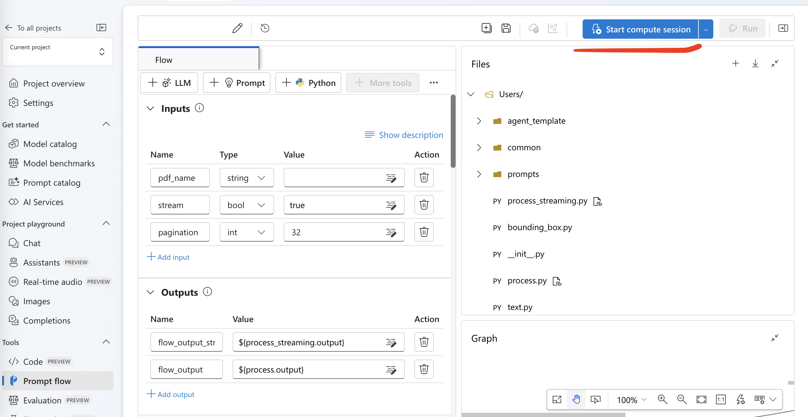
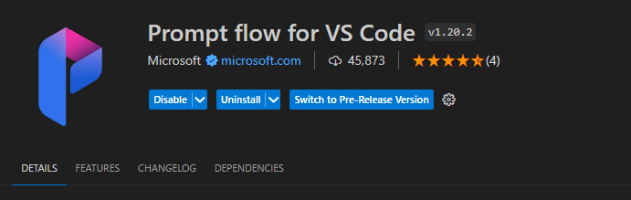
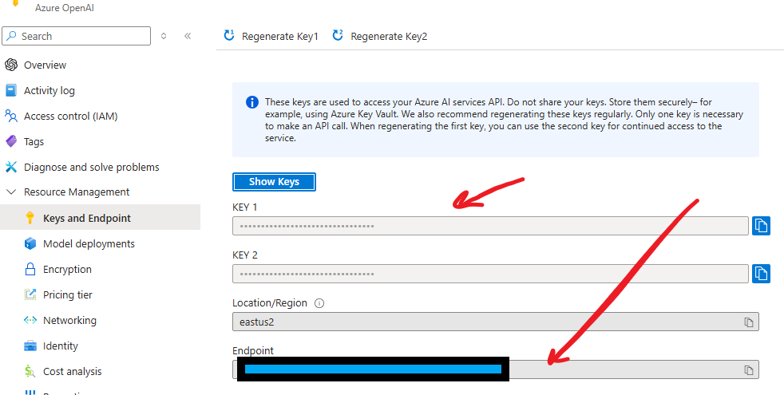
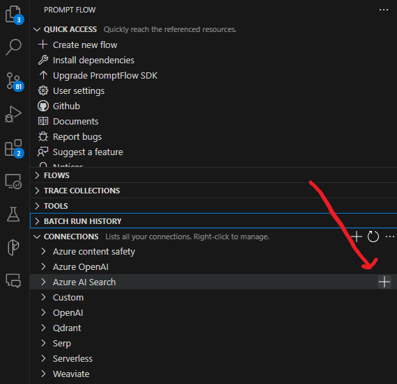
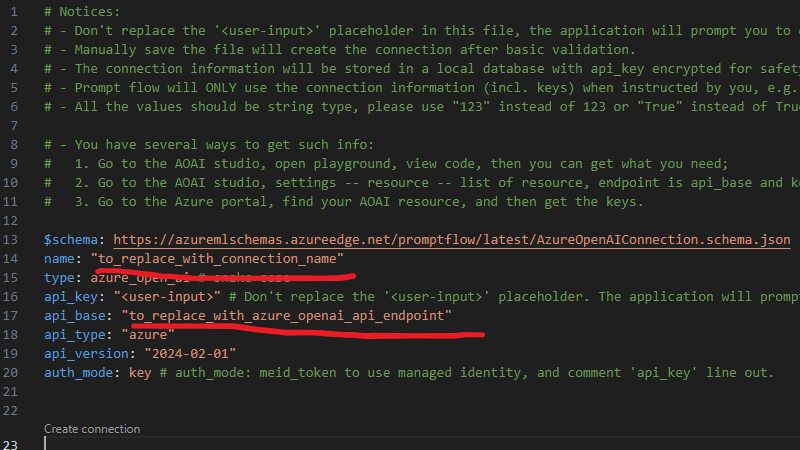
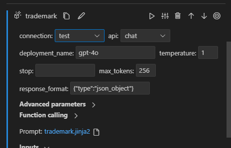
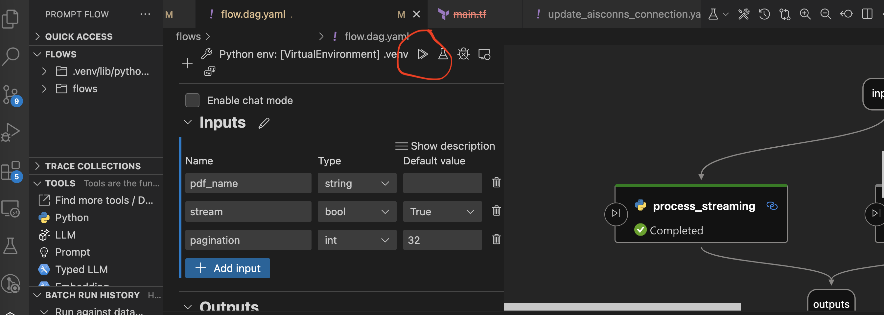

## Set up your machine to work with Promptflow

### Prerequisites

Make sure to follow the steps outlined in [the Getting Started guide](../getting_started.md) to set up your machine with the necessary tools and dependencies.

1. Create a new Python virtual environment in the `flows` directory:

   ```
   cd flows
   python -m venv .venv
   ```

   Activate the environment by running the activate script:

   For Windows:

   ```
   .venv\Scripts\Activate.ps1
   ```

   For Linux / Mac:

   ```
   source .venv/bin/activate
   ```

1. Install dependencies in the virtual environment:

   ```
   python -m pip install --upgrade pip
   python -m pip install -r requirements.txt
   ```

   You should now have the promptflow binary within your virtual environment. Verify this by running:

   ```
   pf --version
   pfazure --version
   ```

1. Login to Azure

   ```
   az login
   ```

1. In the `flows` directory, create a .env file with the following content:

   ```
   AI_HUB_PROJECT_NAME=<azure ai project name>
   SUBSCRIPTION_ID=<subscription ID>
   RESOURCE_GROUP=<resource group name>
   ```

## Deploy flow

1. From the root of the repo, deploy the flow using the following command:

   ```
   task deploy-flow
   ```

   At the end of the output, you will see a link to the Portal UI.

   Click on the link and click "Start compute sesssion" to start working with the flow.

   

   For more information on development with promptflow, refer to the [official documentation](https://learn.microsoft.com/en-us/azure/ai-studio/how-to/prompt-flow).

1. To deploy the evaluation flow, use the following command:

   ```
   task deploy-eval-flow
   ```

   For working with the evaluation flow, refer to the separate [document](./evaluation_flow.md).

1. You can also deploy the agent flow template separately. This is useful if you want to test new prompts for a new agent you are developing. For more information, see [the agent design](./agent_design.md).

   ```
   task deploy-agent-flow
   ```

## Local development with PromptFlow

To use local development tools with Promptflow, repeat the following steps:

1. Install the Promptflow extension for VSCode.

   

   The extension might prompt you to install dependencies for Promptflow. In theory, these dependencies should already be installed into the Python virtual environment that you've created, however if this doesn't work, you might need to install the dependencies using the Python installation on the host machine, as opposed to the virtual environment.

   To do this, start a new terminal and then run the following:

   ```
   python -m pip install --upgrade pip
   python -m pip install -r requirements.txt
   ```

1. Install the pip dependencies for the flow you want to run locally into your virtual environment:

   ```
   pip install -r .\ai_doc_review\requirements.txt
   # OR
   pip install -r .\ai_doc_review_eval\requirements.txt
   ```

1. Create a conneciton to Azure OpenAI.

   You will need the OpenAI endpoint and API key for this step. These can be found on Portal:

   

   In the Promptflow menu on the left hand side, find Azure OpenAI under Connections and click on Plus. A file will be automatically created for you.

   

   In the file, replace the value of the `name` field with `aisconns_aoai`, and `api_base` with the endpoint URL. Save the file and wait for several seconds. A terminal window will open which will request the value of the API key.

   > Make sure to use the exact connection name, `aisconns_aoai`, as this is the name that the flow expects.

   

   Copy the value there and press Enter.

   A connection will be created for you which you can use in your flow.

   

1. Create Custom connections for storing key-value pairs that the flow expects.

   Following the process similar to above, create two more connections of type Custom.

   First connection needs to have a name `aisconns` and contain one secret key named `endpoint` with the value of the Cognitive services account endpoint, e.g. `https://EXAMPLE.cognitiveservices.azure.com/`

   Second connection needs to have a name `document_storage` and contain one secret key named `url_prefix` with the value of the URL prefix for the storage account with the PDF files, e.g. `https://EXAMPLE.blob.core.windows.net/documents/`

   > Note the `/documents/` on the end, the URL prefix has to contain both the storage URL and the container name with the PDF files

1. Now you can run your flow!

   

For more guidance on the structure of the LLM App and adding new agents, refer to the [LLM App document](./llm_app.md).
