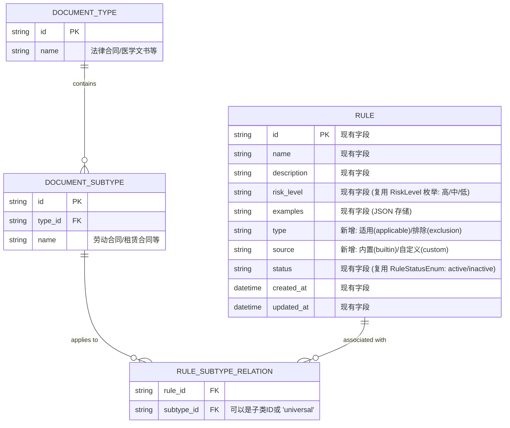

# 设计方案：规则库架构与逻辑 (add-rule-library)

## 架构概览
本设计涉及后端模型扩展、前端页面构建以及 AI 审核引擎的集成逻辑。

## 数据模型设计 (ER)
本设计将扩展现有的 `rules` 表，并新增文书分类相关表。

## 产品逻辑详述
### 规则判定流程
1. AI 获取文档关联的文书子类。
2. 加载与该子类关联的所有“开启”状态的规则。
3. 加载“通用 (Universal)”且开启的规则。
4. 运行审核：
   - 若符合某条**适用规则**且不符合任何相关的**排除规则**，则标记为风险。
   - 若命中**排除规则**，即便违反了适用规则，也视为合规。

## 页面交互逻辑
### 1. 列表页交互
- **状态标识**: 规则名称前置 `●` (绿色代表开启，灰色代表关闭)。
- **Hover 效果**: 鼠标悬停在规则名称上，弹出浮层显示 `description`。
- **风险等级**: 
  - `高`: 背景红色文字。
  - `中`: 背景黄色文字。
  - `低`: 背景绿色文字。

### 2. 弹窗编辑逻辑
- **级联多选**: 
  - 第一层：文书类型（如法律合同）。
  - 第二层：该类型下的子类（如劳动合同、租赁合同）。
  - 特殊选项：首层增加“通用”复选框。选中时，其他选项禁用。

## 技术选型建议
- **后端**: FastAPI + SQLAlchemy。
- **数据库**: **SQLite** (沿用当前 `app.db`)。
- **前端**: React + Ant Design 或类似组件库（用于级联选择器 Cascadar）。
